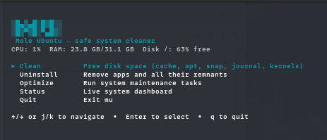

# mu — Mole Ubuntu

A 4 MB binary that cleans, uninstalls, optimizes, and monitors your Ubuntu system. Everything destructive shows you what it's about to do before it does it. Files go to trash, not `/dev/null`.

---

## Install

**One-liner:**
```bash
curl -fsSL https://raw.githubusercontent.com/huaquanghan/mu/main/scripts/install.sh | bash
```

> Install verifies the binary against a release `checksums.txt` asset (SHA-256). Releases must publish `checksums.txt` next to the `mu` binary (`make checksums` after `make build`).

**From source** (requires Go 1.25.8+):
```bash
git clone https://github.com/huaquanghan/mu
cd mu
make build          # → ./bin/mu
make install-local  # → ~/.local/bin/mu (no sudo)
```

> Ubuntu 22.04 ships Go 1.18. Install a newer toolchain: `sudo snap install go --classic`

---



---

## Usage

```
mu                              # interactive TUI menu
mu audit                        # diagnose → select → apply → re-score
mu audit --report               # human report (exit 1=warning, 2=critical)
mu audit --json                 # JSON findings for scripts
mu clean --dry-run              # preview what would be cleaned
mu clean                        # clean with YES/NO confirmation
mu clean --include=browser-cache,docker
mu uninstall                    # search and remove packages + remnants
mu optimize --dry-run           # preview maintenance steps
mu optimize --skip=apt          # skip specific steps
mu status                       # live CPU/RAM/disk/network dashboard
mu status | jq '.health'        # JSON when piped
```

### `mu` (TUI menu)

Opens an interactive menu with a live system snapshot (CPU, RAM, disk). Select any command with arrow keys or `j/k`. Pressing `q` from any sub-screen returns to the menu.

### `mu audit`

Diagnoses cleanup opportunities and health pressure, then guides you through fixes:

1. **Scan** clean categories + disk/RAM/health + journal + apt autoremove signals
2. **Select** findings (opt-in categories like browser/docker stay off unless `--include`)
3. **Confirm** (default NO) → **apply** via the same `clean` / `optimize` paths
4. **Re-score** health and reclaimable space

`--report` / `--json` are read-only. `--dry-run` previews apply without changes. Exit codes for `--report`/`--json`: `0` ok/info, `1` warning, `2` critical.

### `mu clean`

Scans and frees disk space across:

| Category | Default | Flag to enable |
|----------|:-------:|---------------|
| User cache (`~/.cache`) | ✓ | |
| Thumbnail cache | ✓ | |
| APT package cache | ✓ | |
| Journal logs | ✓ | |
| Snap disabled revisions | ✓ | |
| APT autoremove candidates | ✓ | |
| Browser caches (Chrome/Firefox/VSCode) | | `--include=browser-cache` |
| Docker build cache | | `--include=docker` |

### `mu uninstall`

Type to search installed packages (APT + Snap). Space to select multiple. Shows installed size plus leftover config/cache dirs before you confirm. Confirmation requires selecting YES from a button prompt — the default is NO.

### `mu optimize`

Runs: `apt-get update`, APT policy `autoremove --purge`, `journalctl --vacuum-size=500M`, and icon/font/MIME cache refresh. Independent steps continue after failure, show the failed state, and return nonzero after completion. Steps can be skipped per-run (`--skip=apt`) or permanently via config.

### `mu status`

Live-updating dashboard reading directly from `/proc` and mountinfo. Shows CPU%, RAM, real mounted filesystems, network I/O rates, and a root-filesystem-based health score. Unavailable metrics are reported in `scan_errors`. Outputs JSON when stdout is not a TTY.

---

## Safety

- **Trash, not delete.** User-owned files go through `gio trash` or a filesystem-aware, transactional FreeDesktop trash fallback.
- **Protected paths.** Cleanup roots must be absolute and cannot be `/`, home, an ancestor of home, or a protected system path. Cleanup candidates must remain inside their root and cannot be top-level symlinks.
- **APT policy.** `apt-get -s autoremove --purge` supplies the complete preview candidate set. `mu` never constructs a kernel purge list from package-name matching.
- **Fail closed.** Relative XDG paths are ignored. Malformed protection configuration blocks destructive commands, including dry-run.
- **Dry-run everywhere.** Every destructive command has `--dry-run`. No surprises.
- **Audit log.** All operations log to `~/.local/share/mu/operations.log` (10 MB, 1 rotation). Disable: `MU_NO_OPLOG=1`.

---

## Configuration

`~/.config/mu/config.toml` — overrides defaults from `configs/default-whitelist.toml`:

```toml
[protected_paths]
system = ["/data", "/mnt/backup"]

[cache_skip]
dirs = ["my-app/important-cache"]

[optimize_skip]
steps = ["apt"]   # always skip apt in optimize
```

---

## Requirements

- Ubuntu 22.04 / 24.04 LTS (primary). Debian 12+, Pop!\_OS, Mint: compatible, not officially tested.
- Runtime: `gio` (from `glib2`), `dpkg-query`, `journalctl`. `snap` and `docker` are optional.
- Build: Go 1.25.8+.

---

## Contributing

`make test` must pass. `make build` must stay under 25 MB. All destructive paths need a `--dry-run` branch. See `SECURITY.md` for reporting vulnerabilities.
